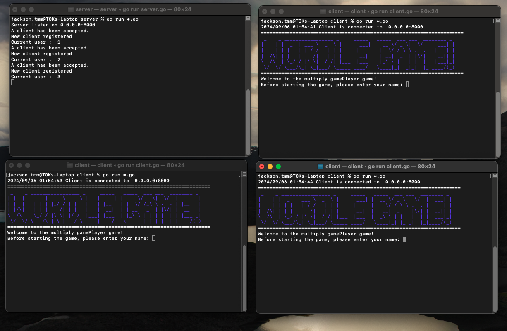

# wordle game
**Validation:**
- Must a word in Dictionary
- Must include English alphabet only and case-insensitive

**Playing rule:**  
- **Hit** - The input letter in the correct spot  
- **Present** - The input letter in the incorrect sport   
- **Miss** - The input letter is not included  

**Playing Rule:**
- **Win**: Guess within the maximum round
- **Loss**: Guess without the maximum round
- **GameOver** / **Win** - show the **answer**

---

### How to start the game

1. Clone the project
> git clone https://github.com/RyanTokManMokMTM/wordle-game.git

2. Download the package
> go mod download

3. (Optinal) Update the config setting
```
1. Client - `core/client/etc`
2. Server - `core/server/etc`
```

4. Go into `core/server` folder and run the command to start up the server
> go run server.go

5.Go into `core/client` folder and run the command to start up the client
> go run client.go

6. Enjoy!

### How to play
1. Create a new room from host(Client A)
2. Join the room created room(Client B)
3. Host start the game

[demo video](./demo/demo.mp4)

---

### File structure
```
.  
├── client                 # client-side code, file and logic        
├──── client               # client interface & implementation   
├──── etc                  # config file  
├──── game                 # game entire point    
├──── internal             # client logic and internal file
├──── render               # render CMD UI  
├── common                 # Tools and utilities
├── server                 # Game Start entry point  
├──── core                 # server/game interface & implementation   
├──── etc                  # config file  
├──── game                 # game entire point    
├──── internal             # client logic and internal file
├──── render               # render CMD UI  
└── README.md              # Doc
```

### Core implementation
#### guessingWordChecking   
> Using a array to indicated there is/are alphabets included in the **guessing word**
- Array size: [a-z][A-Z] , total 52
- Index calculation: according to the ascii code table, `'a'-'a'=0` ,so `arr[0]` =`'a'`, `arr[1]`= `'b'`, `arr[2]` = `'c'` ,`a[26]`=`'A'`, `a[27]`=`'B'`,etc

```
size := len(input)
for i := 0; i < size; i++ {
    //Get the index in couter array by letter(input(i))
    index := utils.LetterIndexOf(rune(in[i]))
    if counter[index] == 0 {
        //The counter do not include this letter
        continue
    }
    
    //The counter include this letter
    if in[i] == guessingWord[i] {
        counter[index] -= 1
        temp[i] = '0'
    }
}
```